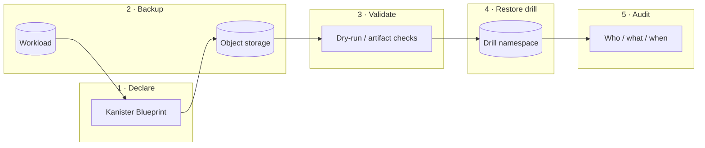

# Kanister Backup & Restore

**Restore should be proved, not assumed.**

Application-aware Kubernetes recovery with Kanister blueprints: backup → validate → restore drill → audit — before the incident starts.

[](https://github.com/justrunme/kanister-backup-restore/actions/workflows/ci.yml)
[](LICENSE)
[](https://justrunme.com/cases/kanister-backup-restore/)

**Status:** flagship blueprint pack + Kind restore drill.

> A volume snapshot preserves bytes.  
> Production restores need application order, namespace context, secrets, validation, status, and operator handoff.  
> This repository turns that path into a **repeatable platform capability**.

Case study: [Kanister Backup & Restore](https://justrunme.com/cases/kanister-backup-restore/) · Author: [Andrey Lesnikov](https://justrunme.com/)

---

## How it works

```text
Blueprint → Backup → Validate → Restore drill → Audit
```



| Step | What operators get |
|---|---|
| **Declare the blueprint** | Backup/restore actions capture app order, secrets, and namespace context — not just PVC bytes |
| **Run app-aware backup** | Coordinated capture into object storage with retention and visible status |
| **Validate before trust** | Dry-run / validation proves the artifact is restoreable while the cluster is still calm |
| **Drill the restore** | Rehearsed restore paths — recovery as a platform capability, not a midnight experiment |

---

## Repository layout

```text
blueprints/          Kanister Blueprint CRs (postgres, generic PVC)
profiles/            Location / Profile examples (S3-compatible)
examples/            Sample StatefulSet to exercise the drill
scripts/             Kind bring-up, install, backup, validate, restore
deploy/              Namespace + Profile wiring
docs/                Architecture and restore-drill notes
```

---

## Quickstart (Kind)

Prerequisites: `docker`, `kind`, `kubectl`, `helm`.

```bash
# 1) Cluster + Kanister operator + demo Postgres
make kind-up
make install-kanister
make demo-app

# 2) Apply blueprints + profile (edit profiles/s3-profile.example.yaml first)
make apply-blueprints
make apply-profile   # requires PROFILE=profiles/s3-profile.yaml

# 3) Backup → validate → restore drill
make backup-drill
make validate-backup
make restore-drill
```

Object storage: use MinIO in-cluster (`make minio`) for local drills, or point the Profile at real S3/GCS/Blob.

---

## Blueprints

### PostgreSQL (`blueprints/postgres/`)

- **backup** — `pg_dump` via `KubeExec`, stream artifact to object store  
- **restore** — restore into a drill namespace with explicit secret/config handling  
- **delete** — retention cleanup for the backup artifact  

### Generic PVC (`blueprints/generic-pvc/`)

- Filesystem-level backup/restore for workloads where logical dump is not applicable  
- Still blueprint-driven (order + status), not a raw VolumeSnapshot-only path  

Blueprints are starting points — tune image tags, DB names, and credentials for your environment.

---

## Evidence model

Every drill should leave an operator-readable trail:

| Signal | Where |
|---|---|
| Blueprint applied | `kubectl get blueprints -A` |
| ActionSet status | `kubectl get actionsets -A` |
| Artifact location | Profile + ActionSet output |
| Validation result | `scripts/validate-backup.sh` exit code + log |
| Restore drill namespace | `restore-drill-*` |

If validation fails, **do not trust the backup** — fix the blueprint before production depends on it.

---

## Make targets

| Target | Purpose |
|---|---|
| `make kind-up` | Local Kind cluster |
| `make install-kanister` | Install Kanister operator (Helm) |
| `make minio` | Optional in-cluster MinIO for drills |
| `make demo-app` | Example Postgres StatefulSet |
| `make apply-blueprints` | Apply Blueprint CRs |
| `make backup-drill` | Create backup ActionSet |
| `make validate-backup` | Artifact / status checks |
| `make restore-drill` | Restore into an isolated namespace |
| `make ci` | Offline checks (YAML structure, scripts) |

---

## Design notes

**Trade-off:** application-aware recovery needs more upfront design than generic snapshots.  
**Payoff:** the recovery path can be tested on a schedule and explained clearly during incidents.

This pack is intentionally blueprint- and drill-centric. It is not a fork of Kanister upstream — it is an **operating model** you can drop into a platform team: declare → backup → validate → restore → audit.

Related case studies:

- [Automatic SaaS Restore System](https://justrunme.com/cases/automatic-saas-restore-system/)
- [Self-Healing Infrastructure](https://justrunme.com/cases/self-healing-infrastructure/)
- [Architecture Rehearsal](https://justrunme.com/cases/architecture-rehearsal/)

---

## License

Apache-2.0 © Andrey Lesnikov
