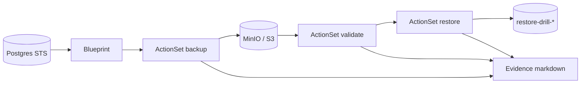

# Kanister Backup & Restore

**Restore should be proved, not assumed.**

Production-minded Kanister pack for application-aware Kubernetes recovery:

```text
Blueprint → Backup → Validate → Restore drill → Evidence
```

[](https://github.com/justrunme/kanister-backup-restore/actions/workflows/ci.yml)
[](LICENSE)
[](https://justrunme.com/cases/kanister-backup-restore/)

**Status:** working Kind drill with MinIO Profile, real `kando location push/pull`, Postgres seed → backup → gzip validate → restore into isolated namespace.

Case study: [Kanister Backup & Restore](https://justrunme.com/cases/kanister-backup-restore/) · [Andrey Lesnikov](https://justrunme.com/)

---

## Why this exists

A VolumeSnapshot preserves bytes. Production restores also need:

- logical application order (`pg_dump` / filesystem contract)
- secrets + namespace context
- artifact validation **before** trust
- an isolated restore drill
- an evidence trail operators can show

This repository turns that into a platform capability you can run on a schedule.

---

## How it works



| Step | Mechanism |
|---|---|
| **Declare** | `postgres-app-aware` Blueprint (`backup` / `validate` / `restore` / `delete`) |
| **Backup** | `pg_dump \| gzip \| kando location push` into Profile object store |
| **Validate** | Pull artifact, `gzip -t`, sample SQL head — fail closed |
| **Restore drill** | Fresh namespace + STS, `kando location pull \| psql` |
| **Evidence** | `scripts/collect-evidence.sh` snapshots ActionSets + artifact path |

---

## One-command Kind drill

Prerequisites: `docker`, `kind`, `kubectl`, `helm`.

```bash
make full-drill
```

This will:

1. Create Kind cluster `kanister-drill`
2. Install Kanister operator (Helm)
3. Deploy MinIO + bootstrap bucket `kanister-drills` + Profile
4. Apply blueprints
5. Deploy demo Postgres, seed `recovery_markers`
6. Backup → validate → restore into `restore-drill-*`
7. Write `evidence-*.md`

Individual steps:

```bash
make kind-up
make install-kanister
make minio
make apply-blueprints
make demo-app
make backup-drill
make validate-backup
make restore-drill
make evidence
```

---

## Repository layout

```text
blueprints/postgres/     Real pg_dump Blueprint (kando + Profile)
blueprints/generic-pvc/  Filesystem tar Blueprint (optional path)
deploy/minio-profile.yaml
deploy/cronjob-backup-drill.yaml
examples/postgres-statefulset.yaml
scripts/                 Kind, install, drills, evidence
docs/                    Architecture + restore runbook
```

---

## Blueprints

### `postgres-app-aware`

Uses `ghcr.io/kanisterio/postgres-kanister-tools:0.118.0`.

- **backup** — `pg_dump --clean --if-exists` of `POSTGRES_DB`, gzip, `kando location push`
- **validate** — pull + `gzip -t` + SQL head sniff
- **restore** — wait `pg_isready`, pull, `psql -v ON_ERROR_STOP=1`
- **delete** — `kando location delete`

Wired to Secret `postgres-credentials` (`POSTGRES_USER` / `POSTGRES_PASSWORD` / `POSTGRES_DB`) and Service `postgres` in the target namespace.

### `generic-pvc-app-aware`

Filesystem tar via `kanister-tools` for workloads where logical dump is not the contract. Requires `/data` (or `DATA_DIR`) available to the task pod.

---

## Scheduled drills

```bash
kubectl apply -f deploy/cronjob-backup-drill.yaml
```

Weekly backup ActionSet against `demo-postgres/postgres`. Pair with validate/restore in your platform pipeline when ready.

---

## Evidence

After a drill:

```bash
make evidence
```

Produces markdown with blueprints, profile, ActionSet states, and the latest `backupLocation`.

---

## Design notes

**Trade-off:** application-aware recovery needs more upfront design than generic snapshots.  
**Payoff:** recovery can be rehearsed while the platform is calm and explained during incidents.

Not a fork of Kanister upstream — an **operating model** and drill pack: declare → backup → validate → restore → audit.

Related cases: [Automatic SaaS Restore](https://justrunme.com/cases/automatic-saas-restore-system/) · [Self-Healing](https://justrunme.com/cases/self-healing-infrastructure/) · [Architecture Rehearsal](https://justrunme.com/cases/architecture-rehearsal/)

---

## License

Apache-2.0 © Andrey Lesnikov
